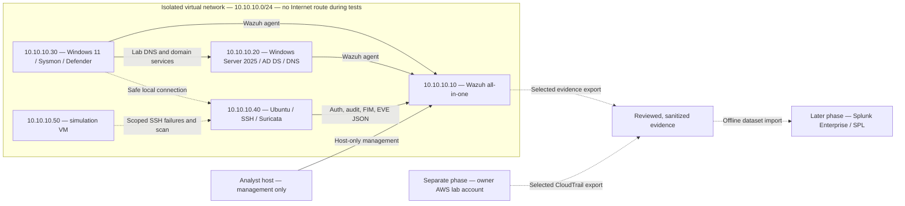

# SOC Blue Team Lab

A hands-on portfolio project for SOC Analyst L1 and Junior Security Operations roles, built around evidence-backed alert triage, investigation, detection improvement, and escalation decisions.

**Current status: Deliverable 0 complete — repository skeleton and proposed architecture only.** No lab infrastructure has been deployed or validated. No simulations, alerts, incident outcomes, or screenshots have been produced. All investigations below are planned. Infrastructure steps are **REQUIRES MANUAL EXECUTION** until access and execution are documented.

Start with the [architecture](docs/architecture.md), [implementation checklist](docs/implementation-checklist.md), and [Deliverable 0 execution report](docs/deliverables/deliverable-0.md).

## Architecture

Proposed addresses, not discovered hosts. Solid arrows describe planned telemetry or DNS flows; dotted arrows describe controlled tests or later data reuse.

Suricata is initially colocated on Ubuntu and observes traffic to/from that endpoint. This does **not** provide whole-network visibility. AWS is a separate environment, outside the isolated virtual network. See [network boundaries and visibility](docs/architecture.md#network-boundaries-and-visibility).

## Environment

| Component | Planned purpose | Status |
| --- | --- | --- |
| Wazuh all-in-one | Central collection, alerts, investigation, custom rules | Not deployed |
| Windows 11 Enterprise evaluation | Security/System, PowerShell, Sysmon, Defender telemetry | Not deployed |
| Ubuntu Server | SSH, authentication, sudo, audit, system logs, file integrity | Not deployed |
| Windows Server 2025 evaluation | AD DS, DNS, test users/groups, identity changes | Not deployed |
| Suricata / Wireshark | IDS events, flow analysis, selected private packet inspection | Not deployed |
| Simulation VM | Bounded lab-only events; safe Atomic Red Team tests where appropriate | Not deployed |
| AWS IAM / CloudTrail / CloudWatch | Owner-account cloud activity investigation | Not configured |
| Splunk Enterprise / SPL | Secondary SIEM analysis of sanitized lab datasets | Deferred; Enterprise Security not used |

## SOC Workflow

Alert → Triage → Investigation → Correlation → IOC Analysis → Timeline → MITRE ATT&CK → Classification → Documentation → Escalation / Closure.

Every completed report will link evidence to a reasoned verdict, severity, and decision. An expected alert that fails to appear is recorded as a **Detection Gap**. Approved simulations are not evidence of a real compromise.

## Investigations

These links open planning stubs, not completed investigations. Detection names describe intended coverage, not rules proven to fire. ATT&CK mappings and outcomes will be added after evidence review.

| ID | Scenario | Planned data source | Planned detection | ATT&CK | Result |
| --- | --- | --- | --- | --- | --- |
| SOC-001 | [SSH brute force](incidents/SOC-001-ssh-brute-force/README.md) | SSH/auth logs, Wazuh | Repeated failures; subsequent success | Pending | Not run |
| SOC-002 | [Windows authentication failures](incidents/SOC-002-windows-authentication/README.md) | Windows Security, Wazuh | Authentication failure burst | Pending | Not run |
| SOC-003 | [Suspicious PowerShell](incidents/SOC-003-suspicious-powershell/README.md) | Sysmon, PowerShell | Suspicious execution pattern | Pending | Not run |
| SOC-004 | [Account / privilege change](incidents/SOC-004-account-privilege-change/README.md) | Security logs on workstation/DC | User creation; privileged group change | Pending | Not run |
| SOC-005 | [Network scanning](incidents/SOC-005-network-scanning/README.md) | Suricata EVE, Wazuh | Port fan-out within a bounded interval | Pending | Not run |
| SOC-006 | [Suspicious network connection](incidents/SOC-006-suspicious-network-connection/README.md) | Sysmon, Suricata, local service | Process-to-destination correlation | Pending | Not run |
| SOC-007 | [DNS investigation](incidents/SOC-007-dns-investigation/README.md) | Sysmon DNS, lab DNS/packet evidence | Query and response analysis | Pending | Not run |
| SOC-008 | [File integrity change](incidents/SOC-008-file-integrity/README.md) | Wazuh FIM, audit | Protected test-file modification | Pending | Not run |
| SOC-009 | [Phishing](incidents/SOC-009-phishing/README.md) | Synthetic email and metadata | Header, URL, attachment analysis | Pending | Not run |
| SOC-010 | [AWS CloudTrail](incidents/SOC-010-aws-cloudtrail/README.md) | CloudTrail, IAM, CloudWatch | Identity/API/change reconstruction | Pending | Not run |

## Detection Engineering

[Wazuh](detections/wazuh/README.md), [Sigma](detections/sigma/README.md), and [Suricata](detections/suricata/README.md) directories are reserved for detections developed from lab evidence. Each rule must explain its objective, source, logic, ATT&CK rationale, expected true positives, false positives, and validation. No custom rules exist yet.

[Analyst playbooks](playbooks/README.md) and [Splunk investigations](queries/splunk/README.md) have defined future scope. Splunk Enterprise and SPL practice will not be presented as Splunk Enterprise Security experience.

## Skills Demonstrated

Deliverable 0 demonstrates lab architecture planning, telemetry requirements, evidence handling, and repeatable reporting structure. Operational skills will be claimed only when linked to completed evidence: Windows/Linux log correlation, IOC analysis, timelines, justified classifications, detection tuning, and escalation decisions.

## Screenshots

None yet. Future screenshots in [screenshots](screenshots/README.md) must support a specific finding and include a caption explaining the evidence. Logs, queries, and analysis remain the primary artifacts.

## Reproducing the Lab

1. Review the [architecture and prerequisites](docs/architecture.md) and [evidence-handling rules](docs/evidence-handling.md).
2. Follow the [implementation checklist](docs/implementation-checklist.md) in deliverable order. Deliverable 1 is Wazuh + Windows + Sysmon telemetry.
3. Validate isolation and time synchronization before each test. Snapshot before state changes; document cleanup.
4. Use the [incident template](templates/incident-report.md) and [playbook template](templates/soc-playbook.md). Preserve uncertainty and failed detections.
5. Validate local documentation links from the repository root with `python3 scripts/validate_repository.py`.

All simulation targets must be specifically owned lab VMs. No public targets, real malware, credentials, VM images, raw log dumps, or sensitive packet captures belong in this repository. The [publication checklist](docs/evidence-handling.md#publication-checklist) supplements `.gitignore`; ignoring files does not sanitize their contents.
