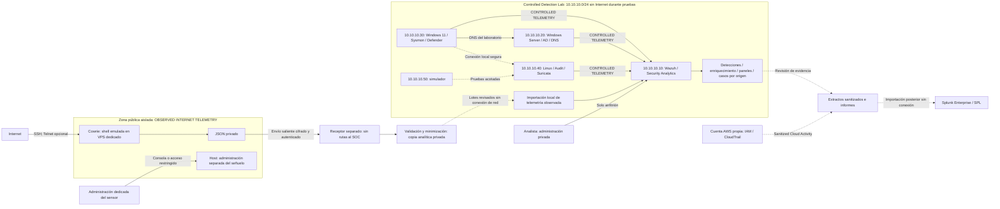

# SOC Blue Team Lab — Hybrid SOC & Internet Honeypot

## Objetivo

Construir una plataforma híbrida con **dos entornos separados**: un laboratorio de detección reproducible y un honeypot público aislado para investigar telemetría no solicitada de Internet. El trabajo del analista será recibir una alerta, investigar qué ocurrió, relacionar evidencias y decidir si el caso debe cerrarse o escalarse.

**Observed Internet activity does not imply compromise of a production environment.** Las simulaciones se identificarán como tales; una sesión aceptada por el honeypot no demuestra compromiso del host ni de un sistema de producción.

El proyecto está orientado a puestos de Analista SOC L1 y Operaciones de Seguridad Junior. Cada investigación deberá mostrar los registros utilizados, la línea de tiempo, el razonamiento y las mejoras de detección que se deriven del caso.

## Controlled Detection Lab

Windows, Linux, Active Directory, Sysmon, Suricata y Wazuh en `10.10.10.0/24`, con simulaciones controladas y reproducibles. **CONTROLLED TELEMETRY.** Se conservan SOC-001–SOC-010, los diseños, las plantillas y el trabajo del entregable 0.

## Internet Honeypot

Cowrie emulado en un VPS o host público dedicado, fuera del laboratorio. Recopilará actividad no solicitada de SSH y, opcionalmente, Telnet: **OBSERVED INTERNET TELEMETRY**. SOC-011–SOC-015 requieren evidencia real y permanecen pendientes. No habrá ruta confiable desde el honeypot hacia la red privada. [Diseño del honeypot](honeypot/README.md).

## Security Analytics

Wazuh será el SIEM principal: ingestión de JSON, parsing, normalización, detecciones verificadas, enriquecimiento de IOC, GeoIP, paneles e investigaciones. El transporte saliente terminará en un receptor separado; la base conserva aislamiento mediante importación de lotes revisados, sin prometer tiempo real. [Flujo de datos y frontera](honeypot/telemetry-pipeline.md).

## Cloud Security

AWS IAM, CloudTrail y CloudWatch se investigarán en una cuenta propia de laboratorio mediante SOC-010. Es una fase independiente del honeypot y sus extractos se publicarán sanitizados. Splunk Enterprise/SPL permanece como fase posterior de análisis.

## Avance del proyecto

**Etapa actual: DELIVERABLE 1 — IN PROGRESS.** Configuración de telemetría Windows y procedimientos preparados; despliegue e ingestión **REQUIRES MANUAL EXECUTION**. El [informe del entregable 1](docs/deliverables/deliverable-1.md) separa configuración escrita, preflight observado y validaciones pendientes. Los entregables 0 y 0.5 siguen cerrados; la [revisión de cierre 0.5](docs/deliverables/deliverable-0.5-review.md) se conserva.

| Área | Avance |
| --- | --- |
| Documentación | Arquitectura preservada; guías de instalación y validación de los cinco canales añadidas |
| Infraestructura | VirtualBox/SOC-LAB inspeccionados; SOC-WAZUH y SOC-WIN11 no registrados en la instancia revisada; despliegues pendientes |
| Investigaciones | SOC-001–SOC-010 controlados preservados; SOC-011–SOC-015 placeholders observados, sin investigar |
| Detecciones | Reglas pendientes de inspeccionar eventos y validar campos |
| Paneles y reporte | Tres especificaciones y plantilla semanal; NO DATA — DEPLOYMENT PENDING |
| Evidencias | Preflight del host registrado; sin telemetría Windows/Wazuh recopilada; originales futuros privados |

**En curso: entregable 1 — Wazuh, Windows y Sysmon.** El [preflight](evidence/deliverable-1/preflight.md) confirma VirtualBox y la red registrada SOC-LAB; faltan medios/rutas y las dos VM. Seguir [Wazuh](docs/wazuh-installation.md), [Windows](docs/windows11-installation.md) y [validación por fuente](docs/telemetry-validation.md). La [matriz](docs/deliverables/deliverable-1.md#matriz-de-validación) permanece sin resultados operativos. La [guía operativa](docs/lab-operations.md) conserva el procedimiento general.

El detalle está en la [arquitectura](docs/architecture.md), el [plan de implementación](docs/implementation-checklist.md), el [informe del entregable 0](docs/deliverables/deliverable-0.md) y el [cierre de 0.5](docs/deliverables/deliverable-0.5.md).

## Arquitectura

Las direcciones del laboratorio se conservan. El sensor y el receptor públicos no tienen IP ni proveedor asignados. Las flechas representan datos; la transferencia de lotes al SOC es sin conexión de red, no un túnel ni una ruta IP.

Cowrie y el receptor estarán fuera de `10.10.10.0/24`, sin acceso confiable al hogar, equipos personales/corporativos, AD ni Windows. Wazuh, su API, indexador y registro de agentes seguirán privados. La decisión del transporte concreto se resolverá antes de cualquier despliegue. Consulta [zonas de confianza](honeypot/security-model.md), [flujo seguro](honeypot/telemetry-pipeline.md) y [decisiones pendientes de HP-1](honeypot/implementation-decisions.md).

Suricata en SOC-LINUX solo observa el tráfico que atraviesa su interfaz; no toda la red ni el VPS. La cobertura pública se evaluará por separado. AWS conserva su fase independiente. Consulta [visibilidad del laboratorio](docs/architecture.md#aislamiento-y-visibilidad-de-la-red) y [Suricata público](honeypot/suricata-visibility.md).

## Entorno

| Componente | Propósito previsto | Estado |
| --- | --- | --- |
| Cowrie en sensor público separado | Interacción SSH/Telnet emulada y JSON de actividad no solicitada | Sin desplegar |
| Receptor de telemetría separado | Transporte autenticado y lotes revisados sin rutas al laboratorio | Infraestructura y mecanismo por decidir |
| Wazuh todo en uno | Recopilación centralizada, alertas, investigación y reglas personalizadas | Sin desplegar |
| Windows 11 Enterprise de evaluación | Telemetría de Security/System, PowerShell, Sysmon y Defender | Sin desplegar |
| Ubuntu Server | SSH, autenticación, sudo, auditoría, registros del sistema e integridad de archivos | Sin desplegar |
| Windows Server 2025 de evaluación | AD DS, DNS, usuarios y grupos de prueba, cambios de identidad | Sin desplegar |
| Suricata / Wireshark | Eventos IDS, análisis de flujos e inspección privada de paquetes seleccionados | Sin desplegar |
| Máquina virtual de simulación | Eventos limitados al laboratorio; pruebas seguras con Atomic Red Team cuando corresponda | Sin desplegar |
| AWS IAM / CloudTrail / CloudWatch | Investigación de actividad en la nube dentro de la cuenta del propietario | Sin configurar |
| Splunk Enterprise / SPL | Análisis en un SIEM secundario con datos del laboratorio sin información sensible | Fase posterior; Enterprise Security no utilizado |

## Flujo de trabajo SOC

Alerta → Evaluación inicial → Investigación → Correlación → Análisis de IOC → Línea de tiempo → MITRE ATT&CK → Clasificación → Documentación → Escalamiento / Cierre.

Cada informe completado relacionará las evidencias con una conclusión, una severidad y una decisión justificadas. Si una alerta esperada no aparece, se registrará una **brecha de detección (Detection Gap)**. Las simulaciones autorizadas no constituyen evidencia de una intrusión real.

## Investigaciones

Cada ficha recoge el objetivo del caso, las fuentes de evidencia y los requisitos para ejecutarlo. La primera investigación será la de fuerza bruta SSH, después de validar la recopilación en Linux. Las correspondencias con ATT&CK y los resultados se completarán a partir de los eventos observados.

| ID | Escenario | Fuente de datos prevista | Detección prevista | ATT&CK | Resultado |
| --- | --- | --- | --- | --- | --- |
| SOC-001 | [Fuerza bruta SSH](incidents/SOC-001-ssh-brute-force/README.md) | Registros SSH y de autenticación, Wazuh | Fallos repetidos y acceso exitoso posterior | Pendiente | Sin ejecutar |
| SOC-002 | [Fallos de autenticación en Windows](incidents/SOC-002-windows-authentication/README.md) | Windows Security, Wazuh | Concentración de fallos de autenticación | Pendiente | Sin ejecutar |
| SOC-003 | [PowerShell sospechoso](incidents/SOC-003-suspicious-powershell/README.md) | Sysmon, PowerShell | Patrón de ejecución sospechoso | Pendiente | Sin ejecutar |
| SOC-004 | [Cambio de cuenta o privilegios](incidents/SOC-004-account-privilege-change/README.md) | Registros Security de la estación y del controlador de dominio | Creación de usuarios y cambios en grupos privilegiados | Pendiente | Sin ejecutar |
| SOC-005 | [Escaneo de red](incidents/SOC-005-network-scanning/README.md) | Suricata EVE, Wazuh | Intentos contra múltiples puertos en un intervalo acotado | Pendiente | Sin ejecutar |
| SOC-006 | [Conexión de red sospechosa](incidents/SOC-006-suspicious-network-connection/README.md) | Sysmon, Suricata, servicio local | Correlación entre proceso y destino | Pendiente | Sin ejecutar |
| SOC-007 | [Investigación DNS](incidents/SOC-007-dns-investigation/README.md) | Sysmon DNS, DNS del laboratorio y evidencias de paquetes | Análisis de consultas y respuestas | Pendiente | Sin ejecutar |
| SOC-008 | [Cambio en la integridad de archivos](incidents/SOC-008-file-integrity/README.md) | Wazuh FIM, auditoría | Modificación de un archivo de prueba protegido | Pendiente | Sin ejecutar |
| SOC-009 | [Phishing](incidents/SOC-009-phishing/README.md) | Correo sintético y metadatos | Análisis de encabezados, URL y archivos adjuntos | Pendiente | Sin ejecutar |
| SOC-010 | [AWS CloudTrail](incidents/SOC-010-aws-cloudtrail/README.md) | CloudTrail, IAM, CloudWatch | Reconstrucción de identidades, llamadas API y cambios | Pendiente | Sin ejecutar |

Los casos anteriores son del **Controlled Detection Lab**. SOC-009 utiliza `Synthetic Training Sample` y SOC-010 `Sanitized Cloud Activity`; los demás, `Controlled Simulation`. Cada ficha identifica **Evidence Origin:** al comienzo, incluso cuando la fuente todavía está pendiente.

Los nuevos casos requieren **Observed Honeypot Telemetry**; son fichas planificadas, no incidentes abiertos:

| ID | Investigación | Dependencia / estado |
| --- | --- | --- |
| SOC-011 | [Internet SSH Brute Force](incidents/SOC-011-internet-ssh-brute-force/README.md) | Autenticación real de Cowrie; NO DATA — DEPLOYMENT PENDING |
| SOC-012 | [Interactive Honeypot Session](incidents/SOC-012-interactive-honeypot-session/README.md) | Sesión real con comandos; NO DATA — DEPLOYMENT PENDING |
| SOC-013 | [Distributed Credential Activity](incidents/SOC-013-distributed-credential-activity/README.md) | Similitudes entre fuentes, sin inferir coordinación; NO DATA — DEPLOYMENT PENDING |
| SOC-014 | [Internet Reconnaissance](incidents/SOC-014-internet-reconnaissance/README.md) | Probing con cobertura verificada; NO DATA — DEPLOYMENT PENDING |
| SOC-015 | [Network Traffic Anomaly](incidents/SOC-015-network-traffic-anomaly/README.md) | Tasas, baseline e impacto; NO DATA — DEPLOYMENT PENDING |

## Paneles, contexto e informes

[Global Honeypot Activity](dashboards/attack-map/README.md), [SOC Overview](dashboards/soc-overview/README.md) y [Network Anomalies](dashboards/network-anomalies/README.md) son especificaciones, sin estadísticas ni dashboards desplegados. El [enriquecimiento](enrichment/README.md) registra fuente, fecha, confianza y limitación. La [Weekly Honeypot Threat Report](reports/templates/weekly-honeypot-threat-report.md) documentará hallazgos, casos y decisiones con evidencia real.

> Geographic information represents the estimated location of the observed source IP address and does not establish the physical location or identity of an attacker.

El mapa representa IP observadas, que pueden ser intermediarios, nodos comprometidos o NAT. Un conteo alto no confirma DDoS. No se ejecutarán cargas ni ataques contra infraestructura pública. T-Pot queda como [fase opcional posterior](honeypot/README.md#fases-posteriores-y-t-pot).

## Ingeniería de detecciones

Los directorios de [Wazuh](detections/wazuh/README.md), [Sigma](detections/sigma/README.md) y [Suricata](detections/suricata/README.md) están reservados para detecciones desarrolladas a partir de evidencias identificadas por origen. La integración Cowrie se reservará en [configs/honeypot/wazuh](configs/honeypot/wazuh/README.md); sus reglas solo se escribirán después de inspeccionar eventos reales de la fuente. Cada regla deberá explicar su objetivo, fuente, lógica, justificación de ATT&CK, verdaderos positivos esperados, posibles falsos positivos y validación. Todavía no existen reglas personalizadas.

Los [procedimientos para analistas](playbooks/README.md) y las [investigaciones con Splunk](queries/splunk/README.md) tienen un alcance futuro definido. La práctica con Splunk Enterprise y SPL no se presentará como experiencia con Splunk Enterprise Security.

## Competencias y evidencias

El trabajo realizado hasta ahora cubre el diseño de la arquitectura, la selección de fuentes de telemetría y la organización de informes y evidencias.

Las siguientes etapas se centrarán en correlacionar registros Windows/Linux, analizar indicadores, reconstruir líneas de tiempo, justificar clasificaciones, ajustar detecciones y preparar escalamientos. Cada competencia se respaldará con el caso y las pruebas correspondientes.

## Capturas de pantalla

Todavía no hay capturas. Las futuras imágenes del directorio de [capturas de pantalla](screenshots/README.md) deberán respaldar un hallazgo concreto e incluir una descripción de la evidencia que muestran. Los registros, las consultas y el análisis seguirán siendo los elementos principales.

## Cómo reproducir el laboratorio

1. Revisa la [arquitectura y los requisitos previos](docs/architecture.md) y las [reglas de manejo de evidencias](docs/evidence-handling.md).
2. Sigue la [lista de implementación](docs/implementation-checklist.md) en el orden de los entregables. El entregable 1, posterior al refactor 0.5, corresponde únicamente a Wazuh, Windows y telemetría de Sysmon; el honeypot tiene fases posteriores propias.
3. Valida el aislamiento y la sincronización horaria antes de cada prueba. Crea una instantánea antes de modificar el estado del sistema y documenta la limpieza posterior.
4. Utiliza la [plantilla de informe de incidentes](templates/incident-report.md) y la [plantilla de procedimiento SOC](templates/soc-playbook.md). Documenta las incertidumbres y los fallos de detección.
5. Valida los enlaces internos de la documentación desde la raíz del repositorio con `python3 scripts/validate_repository.py`.

Todas las simulaciones deben dirigirse exclusivamente a máquinas virtuales propias creadas para este laboratorio. Ninguna simulación se dirigirá a objetivos públicos. La observación futura de Internet se limitará al sensor dedicado, después de verificar AUP, ToS, abuso, límites de ancho de banda y cargos del proveedor en la [lista de despliegue](honeypot/deployment-checklist.md). No publicar malware real, credenciales, URL maliciosas activas, imágenes de máquinas virtuales ni logs sin procesar. Los PCAP completos requieren revisión explícita y permanecen privados por defecto. Los extractos públicos tendrán manifiesto en [datasets/sanitized-honeypot](datasets/sanitized-honeypot/README.md). La [lista de revisión para publicar](docs/evidence-handling.md#revisión-antes-de-publicar) complementa `.gitignore`; ignorar archivos no elimina los datos sensibles de su contenido.
