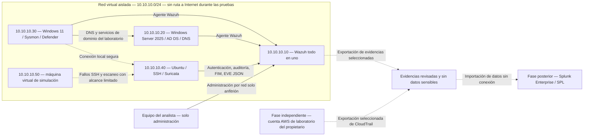

# SOC Blue Team Lab

## Objetivo

Construir un laboratorio SOC para practicar el trabajo de un analista de primer nivel: recibir una alerta, investigar qué ocurrió, relacionar evidencias y decidir si el caso debe cerrarse o escalarse.

El proyecto está orientado a puestos de Analista SOC L1 y Operaciones de Seguridad Junior. Cada investigación deberá mostrar los registros utilizados, la línea de tiempo, el razonamiento y las mejoras de detección que se deriven del caso.

## Avance del proyecto

**Etapa actual: entregable 0 completado — estructura del repositorio y diseño del laboratorio.**

| Área | Avance |
| --- | --- |
| Documentación | Arquitectura, plan de trabajo, manejo de evidencias y plantillas preparados en español |
| Infraestructura | Equipos, red y telemetría definidos; despliegue pendiente |
| Investigaciones | Diez escenarios planificados; todavía sin ejecutar |
| Detecciones | Directorios y criterios definidos; reglas pendientes |
| Evidencias | Por recopilar durante la instalación y las pruebas |

**Lo siguiente:** comprobar los recursos del equipo y el hipervisor, crear la red aislada e instalar Wazuh y Windows 11 con Sysmon. El primer hito operativo será verificar que los eventos lleguen al SIEM desde cada canal configurado. Esta etapa **requiere ejecución manual** en el laboratorio.

El detalle está en la [arquitectura](docs/architecture.md), el [plan de implementación](docs/implementation-checklist.md) y el [informe del entregable 0](docs/deliverables/deliverable-0.md).

## Arquitectura

Las direcciones son propuestas; no corresponden a equipos descubiertos. Las flechas continuas representan flujos previstos de telemetría o DNS; las discontinuas, pruebas controladas o reutilización posterior de datos.

Está previsto instalar Suricata inicialmente en Ubuntu para observar el tráfico entrante y saliente de ese equipo. Esto **no** proporciona visibilidad de toda la red. AWS será un entorno independiente, fuera de la red virtual aislada. Consulta los [límites y la visibilidad de la red](docs/architecture.md#aislamiento-y-visibilidad-de-la-red).

## Entorno

| Componente | Propósito previsto | Estado |
| --- | --- | --- |
| Wazuh todo en uno | Recopilación centralizada, alertas, investigación y reglas personalizadas | Sin desplegar |
| Windows 11 Enterprise de evaluación | Telemetría de Security/System, PowerShell, Sysmon y Defender | Sin desplegar |
| Ubuntu Server | SSH, autenticación, sudo, auditoría, registros del sistema e integridad de archivos | Sin desplegar |
| Windows Server 2025 de evaluación | AD DS, DNS, usuarios y grupos de prueba, cambios de identidad | Sin desplegar |
| Suricata / Wireshark | Eventos IDS, análisis de flujos e inspección privada de paquetes seleccionados | Sin desplegar |
| Máquina virtual de simulación | Eventos limitados al laboratorio; pruebas seguras con Atomic Red Team cuando corresponda | Sin desplegar |
| AWS IAM / CloudTrail / CloudWatch | Investigación de actividad en la nube dentro de la cuenta del propietario | Sin configurar |
| Splunk Enterprise / SPL | Análisis en un SIEM secundario con datos del laboratorio sin información sensible | Fase posterior; Enterprise Security no utilizado |

## Flujo de trabajo SOC

Alerta → Evaluación inicial → Investigación → Correlación → Análisis de IOC → Línea de tiempo → MITRE ATT&CK → Clasificación → Documentación → Escalamiento / Cierre.

Cada informe completado relacionará las evidencias con una conclusión, una severidad y una decisión justificadas. Si una alerta esperada no aparece, se registrará una **brecha de detección (Detection Gap)**. Las simulaciones autorizadas no constituyen evidencia de una intrusión real.

## Investigaciones

Cada ficha recoge el objetivo del caso, las fuentes de evidencia y los requisitos para ejecutarlo. La primera investigación será la de fuerza bruta SSH, después de validar la recopilación en Linux. Las correspondencias con ATT&CK y los resultados se completarán a partir de los eventos observados.

| ID | Escenario | Fuente de datos prevista | Detección prevista | ATT&CK | Resultado |
| --- | --- | --- | --- | --- | --- |
| SOC-001 | [Fuerza bruta SSH](incidents/SOC-001-ssh-brute-force/README.md) | Registros SSH y de autenticación, Wazuh | Fallos repetidos y acceso exitoso posterior | Pendiente | Sin ejecutar |
| SOC-002 | [Fallos de autenticación en Windows](incidents/SOC-002-windows-authentication/README.md) | Windows Security, Wazuh | Concentración de fallos de autenticación | Pendiente | Sin ejecutar |
| SOC-003 | [PowerShell sospechoso](incidents/SOC-003-suspicious-powershell/README.md) | Sysmon, PowerShell | Patrón de ejecución sospechoso | Pendiente | Sin ejecutar |
| SOC-004 | [Cambio de cuenta o privilegios](incidents/SOC-004-account-privilege-change/README.md) | Registros Security de la estación y del controlador de dominio | Creación de usuarios y cambios en grupos privilegiados | Pendiente | Sin ejecutar |
| SOC-005 | [Escaneo de red](incidents/SOC-005-network-scanning/README.md) | Suricata EVE, Wazuh | Intentos contra múltiples puertos en un intervalo acotado | Pendiente | Sin ejecutar |
| SOC-006 | [Conexión de red sospechosa](incidents/SOC-006-suspicious-network-connection/README.md) | Sysmon, Suricata, servicio local | Correlación entre proceso y destino | Pendiente | Sin ejecutar |
| SOC-007 | [Investigación DNS](incidents/SOC-007-dns-investigation/README.md) | Sysmon DNS, DNS del laboratorio y evidencias de paquetes | Análisis de consultas y respuestas | Pendiente | Sin ejecutar |
| SOC-008 | [Cambio en la integridad de archivos](incidents/SOC-008-file-integrity/README.md) | Wazuh FIM, auditoría | Modificación de un archivo de prueba protegido | Pendiente | Sin ejecutar |
| SOC-009 | [Phishing](incidents/SOC-009-phishing/README.md) | Correo sintético y metadatos | Análisis de encabezados, URL y archivos adjuntos | Pendiente | Sin ejecutar |
| SOC-010 | [AWS CloudTrail](incidents/SOC-010-aws-cloudtrail/README.md) | CloudTrail, IAM, CloudWatch | Reconstrucción de identidades, llamadas API y cambios | Pendiente | Sin ejecutar |

## Ingeniería de detecciones

Los directorios de [Wazuh](detections/wazuh/README.md), [Sigma](detections/sigma/README.md) y [Suricata](detections/suricata/README.md) están reservados para detecciones desarrolladas a partir de evidencias del laboratorio. Cada regla deberá explicar su objetivo, fuente, lógica, justificación de ATT&CK, verdaderos positivos esperados, posibles falsos positivos y validación. Todavía no existen reglas personalizadas.

Los [procedimientos para analistas](playbooks/README.md) y las [investigaciones con Splunk](queries/splunk/README.md) tienen un alcance futuro definido. La práctica con Splunk Enterprise y SPL no se presentará como experiencia con Splunk Enterprise Security.

## Competencias y evidencias

El trabajo realizado hasta ahora cubre el diseño de la arquitectura, la selección de fuentes de telemetría y la organización de informes y evidencias.

Las siguientes etapas se centrarán en correlacionar registros Windows/Linux, analizar indicadores, reconstruir líneas de tiempo, justificar clasificaciones, ajustar detecciones y preparar escalamientos. Cada competencia se respaldará con el caso y las pruebas correspondientes.

## Capturas de pantalla

Todavía no hay capturas. Las futuras imágenes del directorio de [capturas de pantalla](screenshots/README.md) deberán respaldar un hallazgo concreto e incluir una descripción de la evidencia que muestran. Los registros, las consultas y el análisis seguirán siendo los elementos principales.

## Cómo reproducir el laboratorio

1. Revisa la [arquitectura y los requisitos previos](docs/architecture.md) y las [reglas de manejo de evidencias](docs/evidence-handling.md).
2. Sigue la [lista de implementación](docs/implementation-checklist.md) en el orden de los entregables. El entregable 1 corresponde a Wazuh, Windows y telemetría de Sysmon.
3. Valida el aislamiento y la sincronización horaria antes de cada prueba. Crea una instantánea antes de modificar el estado del sistema y documenta la limpieza posterior.
4. Utiliza la [plantilla de informe de incidentes](templates/incident-report.md) y la [plantilla de procedimiento SOC](templates/soc-playbook.md). Documenta las incertidumbres y los fallos de detección.
5. Valida los enlaces internos de la documentación desde la raíz del repositorio con `python3 scripts/validate_repository.py`.

Todas las simulaciones deben dirigirse exclusivamente a máquinas virtuales propias creadas para este laboratorio. No se deben incluir objetivos públicos, malware real, credenciales, imágenes de máquinas virtuales, volcados de registros sin procesar ni capturas de paquetes sensibles. La [lista de revisión para publicar](docs/evidence-handling.md#revisión-antes-de-publicar) complementa `.gitignore`; ignorar archivos no elimina los datos sensibles de su contenido.
