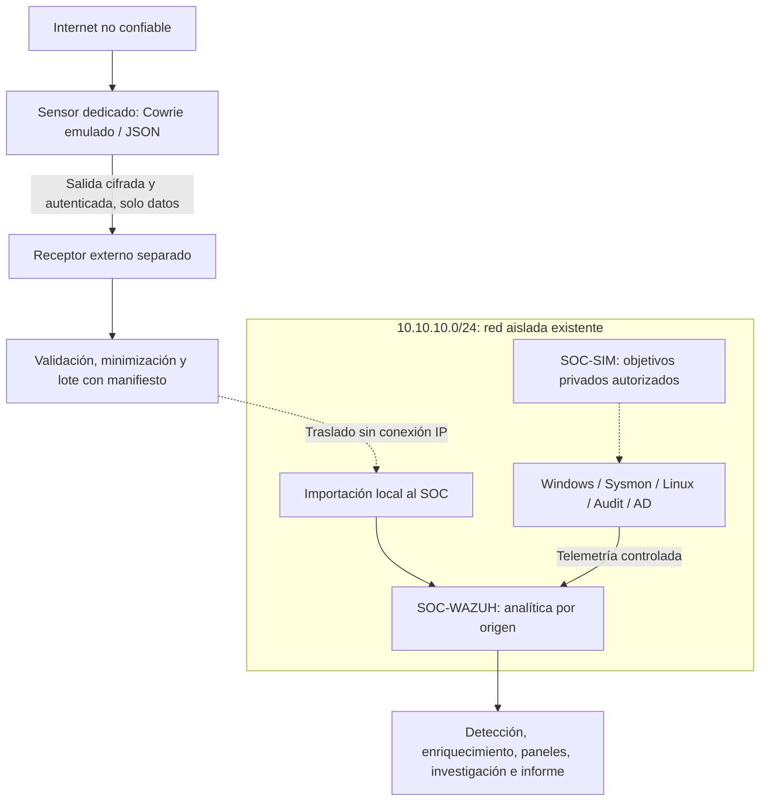

# Arquitectura híbrida del SOC y honeypot

El laboratorio está diseñado para investigar un mismo evento desde tres perspectivas: el equipo donde ocurre, la identidad que lo ejecuta y el tráfico que genera. Wazuh será el SIEM principal. Splunk se incorporará después para practicar consultas sobre los datos obtenidos.

**Avance:** entregable 0.5, arquitectura híbrida definida; infraestructura pendiente de despliegue. Se conserva el diseño del entregable 0 y se añade una zona pública independiente. La instalación y las comprobaciones de red **requieren ejecución manual**. El [diagrama del README](../README.md#arquitectura) muestra la topología propuesta.

## Alcance y requisitos previos

La implementación se divide en etapas para trabajar con pocos equipos encendidos a la vez. Primero se desplegarán Wazuh y Windows 11; después se añadirán Linux, el simulador, la supervisión de red y Active Directory.

El repositorio se inició en un equipo macOS x86_64. Falta comprobar la memoria y el almacenamiento disponibles, seleccionar un hipervisor compatible y revisar los requisitos y licencias de los sistemas invitados. Las versiones y fuentes oficiales de descarga se registrarán durante el entregable 1.

## Dos entornos y una frontera de datos

El **Controlled Detection Lab** conserva `10.10.10.0/24`, equipos, direcciones y simulaciones: **CONTROLLED TELEMETRY**. El **Internet Honeypot** será Cowrie emulado en un VPS/host público dedicado, fuera de esa subred: **OBSERVED INTERNET TELEMETRY**. SOC-001–SOC-010 permanecen ejercicios controlados; SOC-011–SOC-015 requieren actividad no solicitada real. Cada informe declara [Evidence Origin](evidence-handling.md#evidence-origin).

**Observed Internet activity does not imply compromise of a production environment.** La aceptación de una sesión por el señuelo no prueba acceso al host. No habrá shell real para visitantes, backend proxy ni ejecución automática de payloads.

El flujo discontinuo representa transferencia de archivos revisados sin una conexión IP entre zonas. Se conserva Wazuh en `10.10.10.10`; el sensor y el receptor no podrán alcanzar el SOC, hogar, equipos personales/corporativos, AD ni Windows. Tampoco tendrán secretos del laboratorio. No se añade una segunda interfaz pública al SIEM. Las respuestas del protocolo de transporte no constituyen autorización de administración remota.

El patrón base envía telemetría a un receptor separado y transfiere lotes al laboratorio sin conexión de red, con latencia declarada. El protocolo concreto, receptor, periodicidad y medio de transferencia se elegirán con infraestructura disponible en HP-1. Una analítica continua requerirá revisión posterior de las fronteras, sin convertir la red aislada en destino del honeypot. [Pipeline y alternativas admisibles](../honeypot/telemetry-pipeline.md).

El original restringido, la copia analítica privada y el extracto publicable son conjuntos distintos. Retirar credenciales de la copia analítica antes de que el colector Wazuh la lea; revisar también mensajes y comandos que repitan secretos. Las consultas de reputación externas, si se autorizan, se realizarán fuera del SOC aislado y retornarán solo resultados revisados por la misma frontera de datos. Los agregados y correlaciones por lotes usarán tiempo de evento validado; importar una semana en minutos no demuestra una ráfaga de ataques. Estos controles forman parte de la aceptación futura, no están implementados todavía.

| Zona nueva | Identidad/red | Recursos y estado |
| --- | --- | --- |
| Sensor Cowrie | Pública dedicada; proveedor/IP sin asignar; nunca dentro de `10.10.10.0/24` | Por dimensionar según carga, cuotas, retención y Suricata opcional |
| Receptor de telemetría | Separado del sensor y del laboratorio; sin reenviar tráfico del sensor al SOC | Transporte y almacenamiento por elegir; no comparte credenciales del SOC |
| Estación de transferencia | Dedicada, sin doble conexión simultánea ni datos personales | Procedimiento y capacidad por verificar; no es un router |

Estos recursos no están incluidos en las estimaciones del laboratorio siguiente. El proveedor debe permitir explícitamente el uso conforme a AUP/ToS y sus procedimientos de abuso; verificar banda y cargos antes de desplegar. El [modelo de seguridad](../honeypot/security-model.md) contiene matriz de firewall, management plane, egress, fallos y recuperación. La [lista de despliegue](../honeypot/deployment-checklist.md) define los requisitos de apertura.

## Equipos y recursos previstos

Los nombres y las direcciones son parte del diseño. Antes de asignarlos se comprobará que la subred no coincida con la red doméstica, una VPN u otra red virtual.

| Equipo | IPv4 | Función | Recursos iniciales estimados: vCPU / RAM / disco | Etapa |
| --- | --- | --- | --- | --- |
| SOC-WAZUH | 10.10.10.10 | Servidor, indexador y panel de Wazuh en una máquina Linux compatible | 4 / 8 GiB / 80 GB | 1 |
| SOC-DC01 | 10.10.10.20 | Windows Server 2025 de evaluación, AD DS y DNS | 2 / 4 GiB / 64 GB | 7 |
| SOC-WIN11 | 10.10.10.30 | Windows 11 Enterprise de evaluación, agente Wazuh, Sysmon y Defender | 2 / 4 GiB / 80 GB | 1 |
| SOC-LINUX | 10.10.10.40 | Ubuntu Server, OpenSSH, agente Wazuh y auditoría; Suricata más adelante | 2 / 4 GiB / 40 GB | 2; sensor en la 6 |
| SOC-SIM | 10.10.10.50 | Máquina independiente para generar eventos controlados | 2 / 2 GiB / 30 GB | 3 |
| Adaptador de administración | 10.10.10.1, reservada | Acceso del anfitrión al laboratorio; fuera de los objetivos de prueba | Recursos del anfitrión | 1 |

Estos recursos son estimaciones de planificación. La [guía de inicio de Wazuh](https://documentation.wazuh.com/current/quickstart.html) utilizada como referencia recomienda 4 vCPU, 8 GiB de RAM y 50 GB para 1–25 agentes. Se proponen 80 GB para dar margen al laboratorio; la retención dependerá del volumen real de eventos.

Las cinco máquinas suman 22 GiB de RAM y 294 GB de disco virtual, sin contar el sistema anfitrión, los instaladores y las instantáneas. La primera etapa necesita 12 GiB de RAM y 160 GB de disco virtual para los dos invitados. La asignación dinámica de disco y la sobreasignación de CPU no sustituyen una revisión de capacidad. Si los recursos no alcanzan, se reducirán los equipos simultáneos o se utilizará otro equipo propio.

## Aislamiento y visibilidad de la red

La red `10.10.10.0/24` utilizará un conmutador virtual de tipo solo anfitrión, con direcciones estáticas. Durante las simulaciones, los invitados no tendrán puerta de enlace predeterminada y el anfitrión no reenviará tráfico ni compartirá Internet. El acceso de administración al anfitrión queda fuera del alcance de las pruebas.

Antes de cada simulación se revisarán adaptadores, rutas IPv4/IPv6, reenvío del anfitrión, rutas VPN y exposición del cortafuegos. La red de pruebas no tendrá adaptadores en puente, redirecciones públicas de puertos ni rutas hacia redes domésticas o de empresa. El aislamiento se comprobará mediante la configuración y las tablas de rutas, sin sondear sistemas públicos. Si el acceso por la red de administración no está disponible, se usará la consola y se documentará el cambio.

Se podrá habilitar NAT temporalmente para actualizaciones e instalación desde fuentes oficiales. Esa conexión se retirará antes de probar escenarios. Defender permanecerá activo. Las pruebas que cambien el estado de un equipo tendrán una instantánea previa y un procedimiento de limpieza y recuperación.

### Ubicación inicial de Suricata

Suricata capturará en la interfaz de laboratorio de SOC-LINUX. El caso SOC-005 enviará el escaneo desde SOC-SIM hacia SOC-LINUX; el caso SOC-006 generará una solicitud inocua desde Windows hacia un servicio local en SOC-LINUX. Así, el tráfico de ambas pruebas pasará por la interfaz que observa el sensor.

Compartir un conmutador virtual no garantiza que Suricata vea el tráfico unicast entre otros equipos. Para ampliar esa cobertura hará falta configurar y validar una copia del tráfico del conmutador o una ruta de captura específica. La comprobación se hará con un flujo conocido y recuentos de paquetes y eventos.

El tráfico DNS entre Windows y el controlador de dominio se investigará con eventos del equipo, registros del servidor DNS o una captura en esa ruta. El sensor inicial de Ubuntu no cubrirá ese intercambio. Las capturas completas se conservarán de forma privada.

EVE JSON permite registrar alertas, flujos y datos de protocolos. Cada tipo de salida y su cobertura se comprobarán durante la instalación; un registro de flujo no equivale por sí solo a una alerta IDS. La [documentación de EVE](https://docs.suricata.io/en/latest/output/eve/eve-json-output.html) sirve de referencia; antes de configurar Suricata se consultará la documentación de la versión instalada, ya que la rama `latest` puede incluir funciones en desarrollo.

### Visibilidad del sensor público

Suricata en SOC-LINUX no ve Cowrie remoto. Se evaluará otro Suricata pasivo sobre la interfaz pública real del sensor o un punto de copia de tráfico del proveedor, sujeto a permisos y recursos. Registrar interfaz, direcciones de captura, NAT, cobertura, pérdida y tipos EVE: alertas, flujos, DNS y HTTP/TLS disponibles. SSH cifrado no revela sus comandos a la captura; estos provienen de Cowrie. No presumir acceso a tráfico filtrado upstream. [Evaluación detallada](../honeypot/suricata-visibility.md).

### Comunicaciones previstas

La tabla sirve para preparar las reglas del cortafuegos. Los puertos y las restricciones se verificarán al desplegar cada servicio.

| Origen → destino | Servicio previsto | Restricción |
| --- | --- | --- |
| Equipo del analista → Wazuh | Panel HTTPS, normalmente TCP 443; SSH TCP 22 si hace falta | Solo administración; sin exposición pública |
| Agentes registrados → Wazuh | Eventos del agente, normalmente TCP 1514 | Solo agentes del laboratorio |
| Agentes nuevos → Wazuh | Registro de agentes, normalmente TCP 1515 | Equipos definidos y ventana de registro limitada |
| Estación Windows → controlador de dominio | DNS TCP/UDP 53 y servicios necesarios de AD | Completar reglas de unión al dominio y operación en la etapa 7 |
| Simulador → Ubuntu | SSH TCP 22 y puertos aprobados para el escaneo | Destino, número de intentos y puertos definidos por prueba |
| Windows → Ubuntu | Servicio HTTP temporal e inocuo, propuesto en TCP 8080 | Caso SOC-006; detenerlo al finalizar |

El acceso al indexador y a la API interna permanecerá dentro del SIEM todo en uno. Las comunicaciones adicionales, incluidas sincronización horaria, Kerberos, LDAP, SMB, RPC y administración remota, se documentarán antes de habilitarlas. El estado final debe tener reglas justificadas por servicio y origen.

## Identidades, DNS y tiempo

El dominio de prueba será `soc.test` cuando exista SOC-DC01. El sufijo `.test` está reservado para pruebas según [RFC 2606](https://www.rfc-editor.org/rfc/rfc2606.html). Los registros necesarios se alojarán localmente y los reenviadores externos permanecerán desactivados durante las simulaciones.

Las etapas 1–6 pueden funcionar en grupo de trabajo. Los clientes no apuntarán al controlador de dominio antes de que exista ni dependerán de un DNS público en la red aislada. SOC-007 podrá ejecutarse en la etapa 6 si ya hay un resolvedor local de prueba; en caso contrario, quedará pendiente hasta disponer del DNS de AD en la etapa 7.

Se utilizarán identidades ficticias y cuentas separadas para uso normal, simulación y administración. La unión al dominio, los usuarios, los grupos y el registro de cambios autorizados corresponden a la etapa 7. Las credenciales de trabajo o de uso personal quedan fuera del laboratorio.

Los informes usarán UTC y conservarán la zona horaria original y el desfase medido. Primero se verificará la fuente de tiempo del anfitrión y los invitados; después se documentará la sincronización del dominio. Las restauraciones de instantáneas pueden alterar los relojes, por lo que se revisará el desfase antes y después de utilizarlas. La precisión de la línea de tiempo deberá reflejar esa incertidumbre y el retraso de ingestión.

## Telemetría necesaria

Antes de iniciar cada investigación se comprobarán el evento en origen, su recopilación, su llegada al SIEM y los campos disponibles. La tabla define esa cobertura pendiente de validar.

| Fuente | Recopilación prevista | Campos de investigación | Consideraciones |
| --- | --- | --- | --- |
| Windows Security | Canales de eventos mediante Wazuh | Hora, ID, equipo, actor y cuenta afectada, tipo/resultado/estado de inicio de sesión, IP de origen cuando exista | Depende de la política de auditoría; un acceso local puede carecer de IP |
| Windows System | Canales de eventos mediante Wazuh | Hora, equipo, proveedor, ID, servicio y estado | Aporta contexto de salud y cambios de servicios |
| PowerShell Operational | Canales de eventos mediante Wazuh | Hora, usuario/contexto, ID y contenido del bloque de script, equipo | Habilitar registro de bloques y módulos según la necesidad; revisar contenido sensible |
| Sysmon Operational | Canales de eventos mediante Wazuh | ProcessGuid, proceso y padre, líneas de comandos, usuario, hora, direcciones/puertos, consultas y resultados DNS | Configurar tipos y filtros; los campos pueden estar repartidos entre varios eventos |
| Defender Operational | Canales de eventos mediante Wazuh | Hora, equipo y datos de detección, acción o configuración disponibles | Un evento de configuración normal no demuestra detección de malware |
| SSH, autenticación y sudo en Linux | Diario del sistema o archivo de autenticación mantenido por rsyslog | Hora, equipo, usuario, IP/puerto de origen, resultado, servicio, actor/destino/comando de sudo | Identificar la fuente real en Ubuntu y evitar duplicados |
| Auditoría y procesos Linux | Salida de auditoría con reglas acotadas | Hora, ID de auditoría, UID de inicio de sesión y efectivo, ejecutable, PID, argumentos y resultado | Los registros de autenticación no ofrecen por sí solos atribución completa de procesos o red |
| Sistema y aplicaciones Linux | Diario y archivos seleccionados | Hora, equipo, servicio, acción/error y metadatos de solicitudes locales | Registrar servicio y rutas concretas al desplegar |
| Wazuh FIM | Ruta de prueba protegida y dedicada | Archivo, hora, estado/hash anterior y actual; actor si está disponible | Identificar al autor requiere una configuración compatible de auditoría o who-data |
| Security y DNS de AD | Agente en el controlador y registro DNS habilitado | SID del actor y del destinatario, cuenta/grupo, resultado, cliente y respuesta DNS cuando exista | Diferenciar autenticación en el controlador de inicio de sesión en la estación |
| Suricata EVE | Lectura de salida JSON seleccionada desde el agente Ubuntu | Hora, IP/puerto de origen y destino, protocolo, ID de flujo, datos DNS/HTTP/alerta | Solo tráfico capturado; el contenido cifrado puede no estar disponible |
| Cowrie público | JSON privado → receptor separado → lotes revisados → colector local Wazuh | Conceptos requeridos: ID/tipo de evento, tiempo, sensor, origen/puertos, protocolo, usuario, sesión, comando y duración disponible | Rutas JSON y unidades por validar con eventos; sin reglas fabricadas, secretos fuera de evidencia pública |
| Red del sensor público | EVE y contadores del host/proveedor por decidir | Tasas, SYN/estados TCP, flujos, pérdida y disponibilidad | Cowrie no sustituye métricas de red; no confundir logs con volumen de tráfico |
| CloudTrail / CloudWatch | Exportaciones revisadas de la cuenta propia en la etapa 10 | eventTime, eventName, eventSource, userIdentity, sourceIPAddress, resources, solicitud/respuesta, error y eventID | Verificar cobertura de eventos/regiones y entrega a CloudWatch por separado |

Sysmon ofrece eventos de creación de procesos, conexiones y DNS. El registro de conexiones de red está desactivado por defecto según la [documentación de Microsoft](https://learn.microsoft.com/en-us/sysinternals/downloads/sysmon), por lo que se configurará y comprobará de forma explícita.

Un agente conectado no basta para demostrar que todas las fuentes llegan. Las alertas Wazuh contienen eventos que cumplen sus reglas de alerta; algunos eventos inocuos pueden requerir una ruta temporal y acotada de archivo e indexación para validar la recopilación. Se registrará qué ruta se usó y su retención. La ausencia de un evento normal en el índice de alertas no demuestra un fallo del agente. La retención aún está por definir y validar.

## AWS y Splunk

AWS se trabajará en una cuenta propia dedicada al laboratorio. IAM, CloudTrail, CloudWatch, acceso seguro, costes, retención, alcance de los cambios y eliminación de recursos corresponden a la etapa 10. La red local seguirá aislada durante las simulaciones. Solo se publicarán muestras revisadas de CloudTrail sin credenciales, identificadores reales ni direcciones de infraestructura pública.

Splunk será un entorno de análisis secundario para datos del laboratorio sin información sensible. En la etapa 11 se elegirán equipo, versión, recursos, índices y tipos de fuente. La práctica prevista cubre Splunk Enterprise y SPL; Enterprise Security queda fuera del alcance actual.

## Analítica y limitaciones

[Global Honeypot Activity](../dashboards/attack-map/README.md), [SOC Overview](../dashboards/soc-overview/README.md) y [Network Anomalies](../dashboards/network-anomalies/README.md) son diseños sin datos: **NO DATA — DEPLOYMENT PENDING**. La copia analítica de eventos se separa de alertas y pruebas. [Enriquecimiento](../enrichment/README.md) y [reporte semanal](../reports/README.md) registrarán fuente, ventana, calidad, confianza y decisión.

> Geographic information represents the estimated location of the observed source IP address and does not establish the physical location or identity of an attacker.

La IP observada puede representar VPN, proxy, Tor, nube, nodo comprometido o NAT. No inferir ubicación personal, identidad ni coordinación. Los conteos altos no confirman DDoS: hacen falta tasas, baseline, distribución e impacto respaldados por telemetría adecuada o confirmación de un proveedor upstream. No se generará carga contra infraestructura pública.

El [contrato Cowrie/Wazuh](../configs/honeypot/wazuh/README.md) se implementará después de inspeccionar eventos de la versión desplegada; no existen decodificadores ni reglas personalizados todavía. [T-Pot](../honeypot/README.md#fases-posteriores-y-t-pot) queda opcional para después de probar todo el pipeline Cowrie.

## Comprobaciones pendientes

- [ ] Resolver proveedor permitido, transporte y transferencia sin rutas al laboratorio, recursos, egress, retención y recuperación pública antes de desplegar el honeypot.
- [ ] Registrar capacidad del anfitrión, compatibilidad del hipervisor y los invitados, y método de recuperación.
- [ ] Configurar la red y los objetivos permitidos; comprobar rutas, adaptadores y reenvío.
- [ ] Documentar versiones, fuentes de tiempo, políticas de registro e instantáneas.
- [ ] Verificar cada fuente de telemetría de extremo a extremo con un evento inocuo.
- [ ] Demostrar la visibilidad del sensor en la ruta real de cada investigación.
- [ ] Revisar y enlazar evidencias; registrar limpieza y brechas de detección.

El orden de trabajo está en la [lista de implementación](implementation-checklist.md).
