# Flujo seguro de telemetría

**Estado: arquitectura, sin transporte seleccionado, eventos capturados ni integración desplegada.** El mecanismo concreto se decidirá con la infraestructura disponible en HP-1 y se probará antes de abrir Cowrie.

## Flujo y frontera

```mermaid
flowchart LR
    net["Internet: actividad no solicitada"] --> cowrie
    subgraph sensor["Zona pública: sensor aislado"]
        cowrie["Cowrie: shell emulada"] --> json["JSON privado + cola acotada"]
        json --> sender["Emisor de telemetría"]
    end
    subgraph reception["Zona separada: sin rutas al laboratorio"]
        receiver["Receptor autenticado: solo datos"] --> quarantine["Validación, cuota y cuarentena"]
        quarantine --> batch["Lote inmutable + manifiesto"]
    end
    sender -->|"Conexión saliente cifrada y autenticada"| receiver
    batch -.->|"Transferencia revisada sin conexión de red"| importer
    subgraph soc["SOC privado: 10.10.10.0/24"]
        importer["Importación local de JSON aprobado"] --> wazuh["Wazuh: ingestión y parsing"]
        wazuh --> normalized["Normalización validada"]
        normalized --> detection["Detecciones verificadas"]
        normalized --> events["Eventos consultables"]
        detection --> alerts["Alertas"]
        events --> enrichment["Enriquecimiento local"]
        alerts --> enrichment
        enrichment --> views["Paneles e investigaciones"]
    end
    views -.->|"Revisión de evidencia"| published["Extractos sanitizados e informe"]
```

Las flechas representan datos. La línea discontinua hacia el SOC **no representa una conexión IP**. La base será importación por lotes: puede introducir retraso y no promete alertas en tiempo real. Wazuh conserva su dirección y sus agentes privados; no se añade interfaz pública al SIEM ni túnel entre el sensor y el laboratorio.

## Decisión de transporte pendiente

| Alternativa para sensor → receptor externo | Restricciones de aceptación |
| --- | --- |
| HTTPS autenticado, por ejemplo mTLS, hacia un receptor de mensajes | Verificar identidad del servidor, identidad individual del sensor, TLS soportado, límite por mensaje, cuota por sensor, acuse de persistencia y revocación |
| Depósito autenticado en almacenamiento de objetos | Escritura limitada a objetos nuevos en el espacio del sensor, sin leer datos de otros sensores ni borrar/sobrescribir; cifrado, manifiestos e identidad del destino verificados |
| Túnel cifrado restringido al receptor | Solo IP y servicio del receptor; sin anunciar subredes, reenvío, acceso al SOC ni rutas hacia otras redes; autenticación del receptor y de la aplicación |

Elegir **una** alternativa después de comparar infraestructura, costes, permisos, rotación, cola, monitorización, acceso administrativo y recuperación. Documentar endpoints y puertos reales en privado y configuración sin secretos en [configs/honeypot](../configs/honeypot/README.md). Un túnel con acceso a `10.10.10.0/24` no es una alternativa válida. No se expone Wazuh, su API ni su indexador para recibir estos datos.

La exportación del receptor se hará mediante una estación de transferencia dedicada, sin acceso a datos personales ni corporativos. Se validará allí el lote y se entregará solo texto estructurado mediante un medio controlado, sin red simultánea al laboratorio, ejecución automática ni archivos de sesión binarios. Verificar cifrado del almacenamiento/transporte, hash de manifiesto por canal autenticado y permisos de lectura. Importar en una carpeta local dedicada y vigilada por el colector Wazuh. El procedimiento exacto, responsable, periodicidad y aceptación del retraso son decisiones previas al despliegue. Si la infraestructura no permite cumplirlo, HP-1 queda pendiente.

## Contrato y trazabilidad

Los campos técnicos de Cowrie se inspeccionarán en eventos de la versión elegida. [La especificación Wazuh](../configs/honeypot/wazuh/README.md) registra requisitos semánticos, no un esquema inventado. No habrá decodificadores ni reglas antes de disponer de muestras reales de la fuente; las pruebas controladas de integración llevarán su origen separado.

1. Conservar el JSON original privado y la versión de Cowrie, configuración, sensor, época de instalación y fuente horaria. Identificar la procedencia del tráfico mediante inventario y registro de pruebas, no mediante un texto controlado por el cliente.
2. El emisor lee únicamente la salida aprobada. Numerar lotes y registrar hash, rango temporal, número de registros y posición de origen; persistir antes de confirmar recepción. Esos datos son metadatos del pipeline, no campos nativos atribuidos a Cowrie.
3. Validar estructura, codificación, tamaño y tipos; separar registros inválidos en cuarentena privada con contador y motivo. No descartar silenciosamente ni completar campos ausentes con valores ficticios.
4. Registrar tiempo del evento, recepción e ingestión por separado, UTC, desfase y latencia. Distinguir retrasos de exportación por lotes de pausas del sensor.
5. Usar una identidad estable de registro basada en sensor autenticado, época y posición de origen/lote. El ID del tipo de evento y el ID de sesión no identifican un evento único. No deduplicar por IP, usuario y segundo: eliminaría intentos legítimamente repetidos.
6. Reconciliar registros producidos, recibidos, rechazados, importados y repetidos. Reintentar con acuses y checkpoints; no afirmar entrega exactamente una vez. Verificar reinicio, rotación, reenvío, caducidad de credencial y cola llena.
7. Separar eventos consultables de alertas. Los paneles de actividad necesitan eventos, incluidos los que no activan detecciones. Cuotas, acceso y retención se definirán para ambos; el archivo global sin límites puede agotar Wazuh.
8. Normalizar únicamente correspondencias comprobadas y versionadas. Enriquecer sin sobrescribir origen ni confundir destino observado, puerto interno redirigido y destino solicitado en un comando. Luego crear reglas y validar resultados, indexación y consultas por separado.
9. Publicar únicamente extractos revisados con manifiesto, procedencia y transformaciones; mantener originales, credenciales, transcript completo y payloads fuera de Git.

## Separación analítica

`CONTROLLED TELEMETRY` identifica simulaciones y pruebas del operador. `OBSERVED INTERNET TELEMETRY` identifica actividad no solicitada recopilada por el sensor. CloudTrail y muestras sintéticas conservarán además su [Evidence Origin](../docs/evidence-handling.md#evidence-origin). El dato publicado conserva su origen aunque esté sanitizado o se reproduzca localmente.

Una repetición de eventos para probar reglas irá a un conjunto de validación independiente y se excluirá de métricas operativas. Las sondas del operador, comprobaciones de salud y mantenimiento no se contarán como actividad de Internet. El filtro de origen, sensor y ventana debe ser explícito en cada consulta, panel e informe.

## Criterio de aceptación futuro

Conservar evidencia de un registro desde Cowrie hasta una búsqueda Wazuh y una investigación; demostrar campos, tiempo, deduplicación y procedencia. Validar la conducta del sistema ante pérdida de transporte, rechazo y reenvío usando pruebas acotadas en entorno privado. Sin resultados reales, los paneles mostrarán **NO DATA — DEPLOYMENT PENDING**. La ausencia de incidentes interesantes no permite fabricar un caso.
